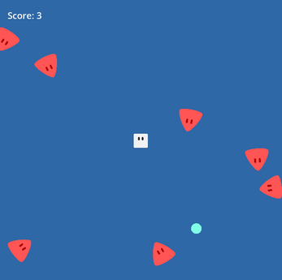

# Dodge Bash

    

## Description

Play as a brave little square in this fast-paced survival game! Pesky triangles are everywhere, ready to poke you into oblivion—dodge them at all costs!

But when you grab a shield, the tables turn. Smash into those pointy troublemakers and rack up extra points!

Simple, fun, and endlessly thrilling. How long can you survive the chaos? Jump into Dodge Bash and find out!

## License
- The source code of this game is available under the [MIT License](LICENSE)
- The Godot engine, which is used to create this game is available under the [following license](https://godotengine.org/license)
